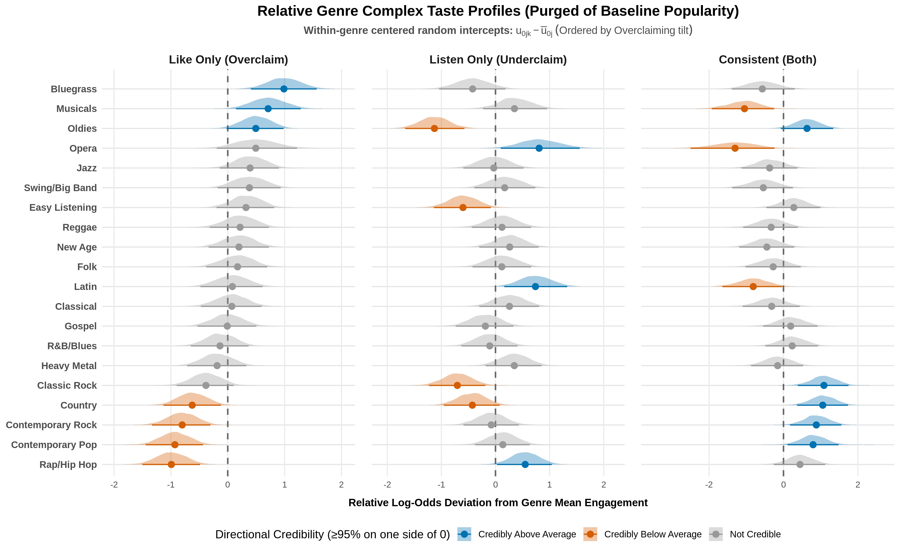
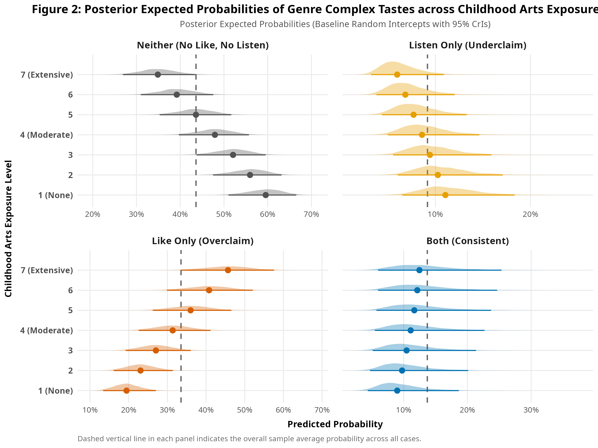
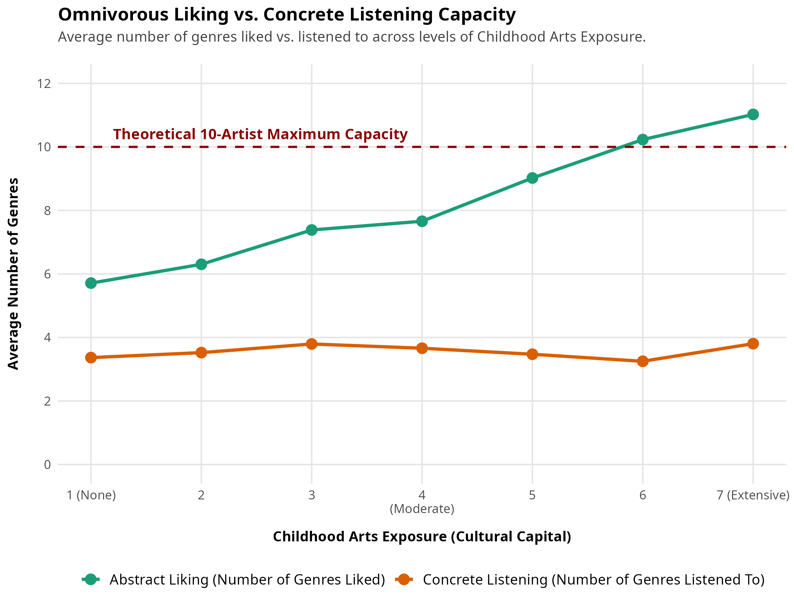
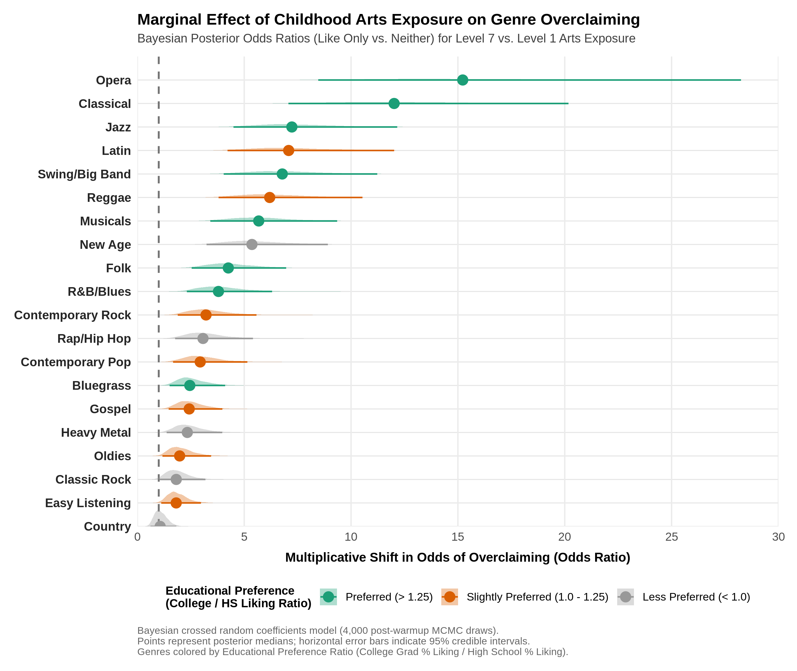
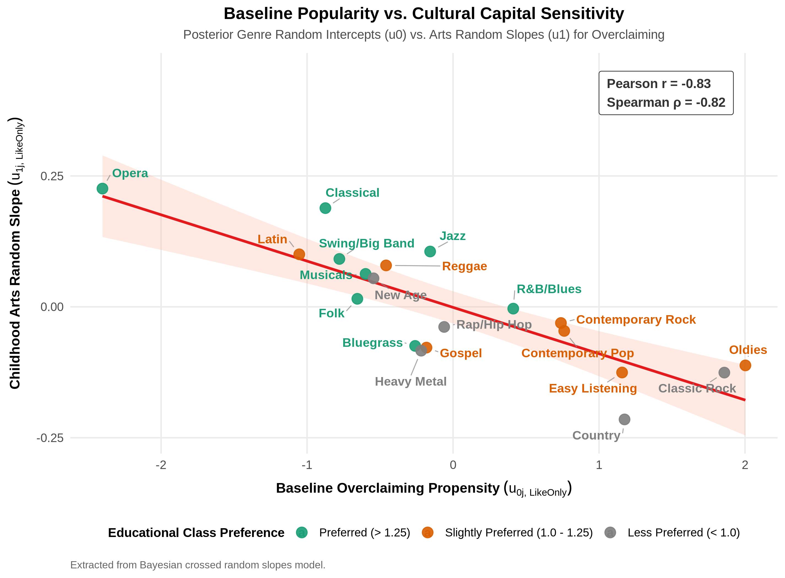
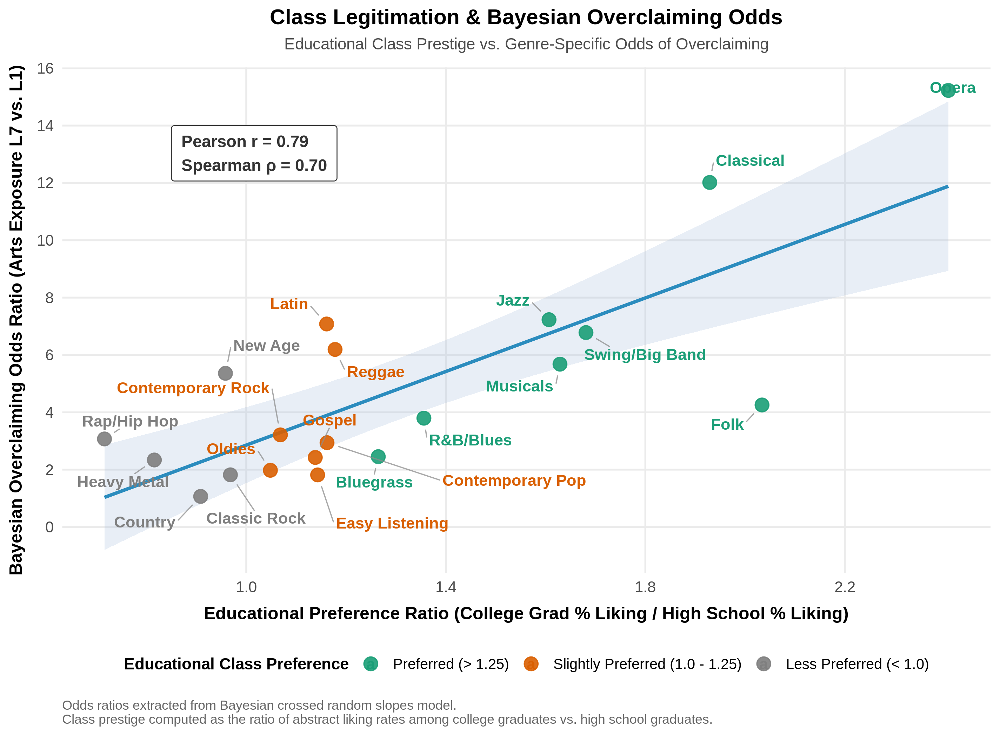

::: {.callout-note}
This report was generated using AI under general human direction. At the time of generation, the contents have not been comprehensively reviewed by a human analyst.
:::

# Introduction

Research on cultural consumption has overwhelmingly studied tastes, and to a lesser extent, knowledge, practices, and meaning-making. While these research agendas have mostly traveled along different—albeit sometimes parallel—tracks, recent theoretical advances have united them into the analysis of what @ma2025 calls "complex tastes." In this framework, valuations (conceptions of whether a cultural object or genre is generally regarded as worthy) are distinguished from preferences (personal likes and dislikes) and both from the active consumption of specific cultural forms.

The key to the argument is that complex tastes emerge because these dimensions can come apart: individuals can like cultural forms they do not deem worthy, consume items they do not explicitly like, and regard as worthy genres they do not actively consume. Much like the distinction between stated and revealed preferences, individuals may overstate their consumption of higher-status cultural forms. Likewise, just as individuals provide justifications for lowbrow consumption—framing it as an "ironic" indulgence or a "guilty pleasure" [@mccoy2014guilty]—in complex tastes they may overclaim or underclaim what they like relative to what they actually consume.

A pure self-report survey methodology is prone to underestimating complex tastes because of consistency bias [@podsakoff2003common], which arises when respondents seek to maintain logical or attitudinal consistency across questions by over-inflating claimed consumption to match their stated preferences. In this study, we examine overclaiming in cultural consumption within musical taste by contrasting abstract genre evaluations against playlist data. Overclaiming occurs when individuals report an affinity for a musical genre in the abstract, yet that genre is absent from the artists and tracks present in their verified listening repertoires. Abstract survey questions regarding cultural preferences may capture aspirational identities, symbolic boundary claiming, or socially desirable affiliations rather than routine everyday consumption. By contrasting abstract genre ratings with playlist data, this analysis evaluates the social distribution and structural determinants of symbolic cultural claims.

To investigate this phenomenon, we harmonize survey responses mapping abstract genre evaluations to verified playlist consumption across twenty musical genres. We estimate Bayesian crossed random-effects multinomial logistic regression models [@burkner2017brms] that simultaneously account for clustering across respondents and variation across musical genres. This modeling strategy permits genre-specific random slopes for cultural socialization, allowing us to test how early cultural capital shapes distinct complex tastes across varying positions in the cultural hierarchy.

# Data Wrangling, Variables, and Preparation

The data preparation aligns self-reported recent listening streams with twenty standardized numeric genre codes and matches them with twenty corresponding survey items gauging abstract genre liking. The resulting dataset combines behavioral measures of consumption, abstract evaluative ratings, and demographic indicators.

### Abstract Genre Liking

Abstract genre liking was assessed through the survey item: *"How much do you like listening to the following genres of music?"* Respondents evaluated their affinity for twenty musical genres (including Classical, Jazz, Musicals/Showtunes, Opera, and Rap/Hip-hop) on a seven-point Likert scale ranging from 1 ("Very Much Dislike") to 7 ("Very Much Like"). This represents the standard approach to measuring cultural taste in social surveys [@bryson1996anything; @lizardo2016musical; @childress2021genres].

### Concrete Listening Behavior

Concrete listening behavior was captured through a dedicated media player retrieval module. Respondents were first screened for their primary music listening platform (`how_listen`) and prompted regarding real-time access to their music libraries: *"Do you currently have access to your iTunes?"* (or Spotify / Winamp). For respondents with active player access, the survey provided specific instructions to open their media player application, sort their music library by "Plays" or play counts, and record the names of their top ten artists or bands alongside their associated play counts and genre tags (`itunes_1_1` through `itunes_10_3`, `spotify_comp1_1_1` through `spotify_phone1_10_1`, and `winamp_monkey_1_1` through `winamp_monkey_10_3`). For respondents accessing music without play count logging or through general streaming, the survey asked them to enter the top ten musical artists currently in regular rotation in their everyday listening (`rotation1_1_1` to `_rotation2_10`). The listed artists were subsequently classified into the corresponding twenty broad genre categories.

### Complex Taste Indicators

We construct two binary indicators for each person-genre observation. Liking (`like`) is assigned a value of 1 if the respondent evaluated their affinity for the genre at 5, 6, or 7 on the seven-point scale, and 0 otherwise. Listening (`listen`) is assigned a value of 1 if the genre appeared at least once among the respondent's top ten reported playlist artists, and 0 otherwise. The wide survey records are subsequently reshaped into a long-format structure in which the unit of analysis is the person-genre dyad.

To evaluate overclaiming within a unified categorical framework, we specify four mutually exclusive complex tastes for every person-genre dyad. The baseline complex taste, *Neither*, comprises instances where an individual neither likes nor listens to the genre. The *Underclaiming* (Listen Only) complex taste describes cases where an individual listens to an artist in that genre but does not express abstract liking, capturing unacknowledged or ambient consumption [@ma2026]. The *Overclaiming* (Like Only) complex taste denotes instances where an individual expresses abstract liking for a genre that is absent from their listening repertoire, indicating symbolic claim without behavioral enactment. Finally, the *Consistent* (Both) complex taste captures congruent active engagement, where reported liking is accompanied by documented listening.

### Cultural Capital Indicators

Early cultural socialization is measured by childhood arts exposure (`child_arts`), based on the survey item: *"During your childhood how frequently did your parents or guardians engage you with the arts?"*, rated on a seven-point scale from 1 ("Not At All") to 7 ("All The Time"). Educational attainment (`educ2`) is derived from the survey prompt: *"What is the highest degree or level of school you have completed?"* The original seven response tiers (ranging from less than 9th grade to an advanced degree) are recoded into six analytical categories: Less than High School, High School Graduate, Some College, Associate's Degree, Bachelor's Degree, and Graduate Degree. Parental education (`parent_educ`) is constructed as the household maximum of maternal (`mom_educ`) and paternal (`dad_educ`) educational attainment using the identical six-tier scale.

### Other Socio-Demographic Variables

Respondent demographic controls incorporate age, gender, household income, and ethnoracial background. Respondent age is elicited via birth year (ranging from 1928 to 2000) and categorized into six generational cohorts (`agecat`): Under 30 (born 1989–2000), 30–39 (born 1979–1988), 40–49 (born 1969–1978), 50–59 (born 1959–1968), 60–69 (born 1949–1958), and 70 and Older (born 1928–1948), entered in each model as a single ordinal variable. Gender is asked with options for Female, Male, and Other, operationalized in the regression equations as a binary indicator for women (`female`). Household income (`income`) is prompted through the question: *"Please indicate the answer that includes your entire household income before taxes"*, measured across twelve income brackets spanning from Less than $10,000, $10,000–$19,999, $20,000–$29,999, through subsequent $10,000 increments up to $150,000 or More. Ethnoracial identification (`race5`) collapses eight raw survey options (White, Black or African American, Native American, Pacific Islander, Hispanic/Latino, Asian, Middle Eastern, and Other) into five standardized categories: White (baseline), Black, Hispanic, Asian, and Other/Mixed. Finally, we adjust for streaming platform source (`platform`), which is classified into four operational modes: Free Recall, iTunes, Spotify, and Winamp.

### Statistical Modeling Strategy

All data processing, Bayesian estimation, statistical analyses, and data visualizations are implemented in the R statistical computing environment (version 4.5.3; @rcoreteam2026). To accommodate the crossed hierarchical structure of the data ($N = 1,574$ respondents evaluated across $J = 20$ musical genres, yielding $24,457$ dyads), we estimate Bayesian crossed random-effects multinomial logistic regressions using the `brms` package (version 2.23.0; @burkner2017brms; @burkner2018advanced) via the `cmdstanr` interface [@gabry2024cmdstanr] to CmdStan (version 2.39.0; @stan2024cmdstan; @carpenter2017stan).

Our analytical strategy proceeds in four sequential steps:

First, we estimate a baseline crossed random intercepts model with fixed effects for cultural capital and demographic covariates, examining overall genre-level tendencies to be overclaimed, underclaimed, or consistently engaged after correcting for baseline popularity.

Second, we implement a Bayesian formulation of the Wald test to evaluate the omnibus explanatory power of fixed-effects constructs, identify the primary cultural capital predictor, and inspect equation-specific parameter estimates across complex taste configurations alongside population-level predicted probabilities.

Third, we examine whether the returns to cultural capital vary across musical genres by evaluating random slopes models with progressively relaxed constraints.

Fourth, we analyze the structure of the genre random effects from the optimal specification to test whether high-cultural-capital individuals overclaim specific types of genres, evaluating how overclaiming odds relate to baseline popularity and educational class prestige.

In the baseline crossed random intercepts specification (Model 1), the linear predictor for respondent $i$ evaluating genre $j$ across active complex tastes $s \in \{\text{ListenOnly}, \text{LikeOnly}, \text{Both}\}$ relative to the baseline reference state $\text{Neither}$ is formulated as:
$$\eta_{ijs} = \alpha_s + \mathbf{X}_i \boldsymbol{\beta}_s + u_{0is} + u_{0js} \tag{1}$$
where $\alpha_s$ represents the state-specific intercept, $\mathbf{X}_i$ is the vector of respondent-level predictors with corresponding fixed-effect coefficient vector $\boldsymbol{\beta}_s$, $u_{0is} \sim \mathcal{N}(0, \sigma^2_{\text{id}, s})$ represents the respondent random intercept capturing individual-level engagement propensities, and $u_{0js} \sim \mathcal{N}(0, \sigma^2_{\text{genre}, s})$ denotes the genre random intercept capturing baseline genre popularity. In this baseline specification, the effects of all individual-level predictors—including childhood arts exposure—are assumed to be homogeneous across genres.

To test whether the returns to cultural capital vary systematically across cultural genres, we extend the baseline model to the crossed random coefficients (random slopes) specification:
$$\eta_{ijs} = \alpha_s + \mathbf{X}_i \boldsymbol{\beta}_s + u_{0is} + u_{0js} + u_{1js} \cdot \text{child\_arts}_i \tag{2}$$
where $u_{1js} \sim \mathcal{N}(0, \sigma^2_{\text{arts}, s})$ is the genre-specific random slope allowing the effect of childhood arts exposure on state $s$ to vary across musical genres. Weakly informative regularizing priors are assigned to all fixed effects ($\beta \sim \mathcal{N}(0, 1.5)$), random-effects standard deviations ($\sigma \sim \text{Exponential}(1)$), and random-effects correlation matrices ($\mathbf{\Omega} \sim \text{LKJ}(2)$). All models are estimated using Hamiltonian Monte Carlo across four chains with 2,000 iterations each (1,000 warmup iterations and 1,000 post-warmup sampling iterations per chain).

# Results

## Step 1: Genre-Level Complex Tastes: Random Intercept Estimates

To examine baseline propensities for each complex taste across the twenty musical genres after adjusting for individual-level demographics, we evaluate the genre random intercepts ($u_{0j}$) from the baseline Bayesian crossed random intercepts model. In a multinomial logistic regression with reference baseline $Y = \text{Neither}$, each of the three logit equations models the log-odds of entering state $k \in \{\text{LikeOnly}, \text{ListenOnly}, \text{Both}\}$ relative to complete non-engagement:
$$\log\left(\frac{P(Y = k \mid \text{genre } j)}{P(Y = \text{Neither} \mid \text{genre } j)}\right) = \alpha_k + u_{0j}^{(k)} + \mathbf{X}\boldsymbol{\beta}_k \tag{3}$$

Because all three logit equations share the identical baseline denominator ($P(\text{Neither})$), the raw genre random intercepts $u_{0j}^{(k)}$ are heavily structured by overall genre popularity or the volume of complete population non-engagement. For niche or highbrow genres where the vast majority of respondents neither listen nor like (such as Opera at 80.2% *Neither* or Bluegrass at 63.0% *Neither*), the large baseline denominator shifts the random intercepts for all three complex tastes simultaneously into negative territory. Conversely, for widely popular mainstream genres (such as Classic Rock at 12.1% *Neither* and Contemporary Pop at 17.9% *Neither*), the small non-engagement baseline elevates intercepts across all three states into positive values.

Empirically, raw genre random intercepts across all three states correlate with overall genre popularity ($P(\text{Any Engagement})$) at $r > 0.92$. Consequently, raw intercept rankings across states yield superficially similar hierarchies that primarily reflect genre mass appeal rather than distinct qualitative complex tastes. To isolate each genre's qualitative tendency toward overclaiming, underclaiming, or consistent engagement, we correct for the shared popularity effect by calculating within-genre centered random intercepts across posterior draws:
$$\Delta u_{0j}^{(k)} = u_{0j}^{(k)} - \bar{u}_{0j}, \quad \text{where } \bar{u}_{0j} = \frac{1}{3}\sum_{m \in \{\text{LikeOnly}, \text{ListenOnly}, \text{Both}\}} u_{0j}^{(m)} \tag{5}$$

By subtracting the genre's mean random intercept $\bar{u}_{0j}$, the shared baseline volume cancels out. A positive deviation ($\Delta u_{0j}^{(k)} > 0$) signifies that a genre exhibits a disproportionate excess tilt toward complex taste $k$ relative to its own baseline engagement level, whereas $\Delta u_{0j}^{(k)} < 0$ indicates under-representation in that complex taste. A deviation is classified as directional credible if at least 95% of its posterior probability density falls on one side of zero ($\text{pd} \ge 0.95$). Figure 1 displays these popularity-purged engagement profiles across all twenty musical genres.

The popularity-corrected profiles suggest three distinct qualitative complex taste configurations across musical genres. In the symbolic overclaiming configuration, genres credibly tilted toward overclaiming (*Like Only*) include Bluegrass, Oldies, Musicals, Easy Listening, Jazz, Swing/Big Band, and Opera. Conditional on any engagement occurring, these styles are disproportionately liked in the abstract without corresponding playlist listening, which may reflect nostalgic affection (in the case of Oldies) or aspirational symbolic attachment (in the case of Opera, Jazz, and Musicals). In contrast, the consistent engagement configuration comprises genres credibly tilted toward *Both*, including Classic Rock, Country, Contemporary Rock, and Contemporary Pop. For these established genres, reported liking is corroborated by active listening repertoires. Finally, the underclaiming configuration includes styles credibly tilted toward *Listen Only*, such as Latin, Rap/Hip Hop, Heavy Metal, and Contemporary Pop. These genres exhibit elevated rates of playlist playback unaccompanied by reported high liking, likely reflecting ambient listening, algorithmic playlist exposure, or unacknowledged consumption.

## Step 2: Global Variable Importance: Bayesian Joint Wald Tests

In multinomial logistic regression, categorical and continuous predictors contribute multiple parameters across competing logit equations. Evaluating individual coefficients in isolation can obscure the omnibus explanatory contribution of a construct across the full system of complex tastes. To establish an overall hierarchy of predictor importance, we test the joint null hypothesis that all parameters associated with a given construct are simultaneously zero ($H_0: \boldsymbol{\beta}_k = \mathbf{0}$) across all three active complex taste logits relative to the baseline state (*Neither*).

We compute the Bayesian Joint Wald statistic using the posterior parameter distributions from the baseline crossed random intercepts model (Model 1). Estimating omnibus test statistics from this baseline model provides a clean assessment of global predictor importance before introducing genre-level slope variation. The test statistic is evaluated from the posterior mean parameter vector $\bar{\boldsymbol{\beta}}_k = \mathbb{E}[\boldsymbol{\beta}_k \mid \mathcal{D}]$ and the posterior covariance matrix $\boldsymbol{\Sigma}_{\text{post}, k} = \text{Cov}_{\text{post}}(\boldsymbol{\beta}_k \mid \mathcal{D})$, calculated as the squared Mahalanobis distance from the null origin:
$$W_{\text{Bayes}} = \bar{\boldsymbol{\beta}}_k^\top \boldsymbol{\Sigma}_{\text{post}, k}^{-1} \bar{\boldsymbol{\beta}}_k \tag{4}$$

Under asymptotic posterior normality, $W_{\text{Bayes}}$ follows a $\chi^2$ distribution with degrees of freedom equal to the parameter count $K = \dim(\boldsymbol{\beta}_k)$. Because the covariance matrix is derived directly from the hierarchical posterior draws, this test naturally incorporates uncertainty from both respondent- and genre-level clustering.



### Best Predictor Analysis

As Table 1 shows, the multivariate Wald tests identify childhood arts exposure as by far the primary predictor of complex musical tastes ($\chi^2 = 134.44$, $df = 3$, $p < 0.001$). Streaming platform retrieval method ranks second ($\chi^2 = 40.10$, $df = 9$, $p < 0.001$), reflecting differences in behavioral reporting precision across playlist platforms and recall modes. Ethnoracial identification ($\chi^2 = 18.48$, $df = 12$, $p = 0.102$) and educational attainment ($\chi^2 = 18.31$, $df = 3$, $p < 0.001$) follow in explanatory magnitude. In contrast, parental education ($\chi^2 = 3.12$, $df = 3$, $p = 0.373$), household income ($\chi^2 = 2.31$, $df = 3$, $p = 0.510$), and gender identification ($\chi^2 = 1.90$, $df = 3$, $p = 0.593$) display comparatively modest joint contributions, indicating that the transmission of parental social advantage into complex musical consumption is largely mediated through direct cultural socialization in childhood.

### Detailed Coefficient Estimates Across Complex Tastes

The Bayesian parameter estimate tables present posterior distributions across all three active complex tastes relative to the baseline reference category (*Neither*). Posterior means and medians characterize central tendency, while the posterior standard deviation quantifies estimation uncertainty in a manner analogous to classical standard errors. The 95% Credible Intervals (2.5% to 97.5% quantiles) delineate the parameter range containing 95% of the posterior mass. The Probability of Direction ($pd$) reports the proportion of posterior draws sharing the sign of the median estimate, indexing directional certainty where values exceeding 97.5% approximate conventional significance thresholds.







The posterior estimates from the baseline random intercepts model indicate that childhood arts exposure is a strong, substantively significant positive predictor of overclaiming ($\bar{\beta} = 0.231$, 95% CrI: [0.188, 0.274], $pd = 100\%$). While arts exposure also positively predicts consistent engagement ($\bar{\beta} = 0.141$, 95% CrI: [0.091, 0.191], $pd = 100\%$), its substantive effect on overclaiming is markedly larger. In contrast, childhood arts exposure does not reliably predict underclaiming ($\bar{\beta} = -0.014$, 95% CrI: [-0.062, 0.033], $pd = 71.6\%$). Educational attainment exhibits a consistent positive association across all three active complex tastes relative to non-engagement ($\bar{\beta} = 0.070$, 95% CrI: [0.017, 0.124] for overclaiming; $\bar{\beta} = 0.092$, 95% CrI: [0.029, 0.154] for underclaiming; and $\bar{\beta} = 0.091$, 95% CrI: [0.026, 0.156] for consistent engagement), suggesting that the primary effect of acquired educational credentials is to move respondents out of complete non-engagement and into active engagement categories. In contrast, the credible intervals for parental education and household income include zero across all equations, demonstrating that the intergenerational transmission of socioeconomic advantage into complex musical consumption is largely mediated through direct cultural socialization rather than financial capital.

### Visualizing the Effect of Arts Exposure on Complex Tastes

To illustrate the substantive consequences of cultural capital across the complex taste typology, we compute posterior expected probabilities across the seven levels of childhood arts exposure from the baseline crossed random intercepts model, holding demographic covariates constant at sample medians and reference modes. Specifically, counterfactual expectations are generated across all 4,000 post-warmup Hamiltonian Monte Carlo posterior parameter draws for an idealized reference respondent with median education (tier 3, Some College), median parental education (tier 3), age cohort 30–39, male gender identification, median income bracket ($40,000–$49,999), White racial identification, and Free Recall platform reporting. Applying the multinomial softmax inverse-link transformation while integrating over the crossed random effects yields the full posterior predictive distribution of state probabilities $\hat{P}(Y = k \mid \text{child\_arts})$ for each exposure level.

The resulting posterior distributions are visualized using half-eye plots, which combine continuous density estimation with discrete interval summaries. For each level of arts exposure, the curved upper slab displays the posterior probability density function, visualizing the exact shape, spread, and skewness of the expected probability distribution. The solid central point denotes the posterior median (50th percentile), representing the primary estimate of central tendency, while the single horizontal error bar delineates the 95% credible interval (spanning the 2.5th and 97.5th percentiles). This integrated visual format allows for simultaneous inspection of central tendency, parametric uncertainty, and distributional asymmetries across the four complex tastes.

As Figure 2 illustrates, as childhood arts socialization shifts from minimal ($1$) to extensive ($7$), the predicted probability of overclaiming increases from 19.4% (95% CrI: [13.4%, 27.0%]) to 45.7% (95% CrI: [33.7%, 57.6%]), representing an increase of over 26 percentage points across the range of arts exposure. Over the same interval, the predicted probability of consistent engagement increases modestly from 9.0% (95% CrI: [4.4%, 18.7%]) to 12.5% (95% CrI: [6.0%, 25.3%]), while underclaiming declines from 11.1% to 6.0% and the probability of remaining unengaged (*Neither*) drops by more than half from 59.5% to 34.9%. Consequently, respondents with low exposure exhibit a markedly higher probability of complete non-engagement than overclaiming, whereas the reverse holds for respondents with extensive arts socialization. These divergent trajectories demonstrate that early cultural exposure exerts its primary substantive influence on expanding individuals' propensity to trade non-engagement for symbolic overclaiming across unlistened genres.

### Methodological Note: The Divergence of Omnivorousness and Cap Constraints

When respondents are allowed to rate 20 genres on a Likert scale but can only list up to 10 artists in regular rotation, it is reasonable to hypothesize whether a forced "ceiling effect" artifactually produces overclaiming among high-cultural-capital (CC) individuals. Specifically, if early socialization increases omnivorousness (the number of genres *liked*), high-CC respondents might simply run out of room in their top 10 artist slots, forcing them to mechanically overclaim on whatever genres didn't make the cut.

However, the survey data refutes this mechanical constraint argument. As Figure 5 below illustrates, while childhood arts exposure sharply increases the volume of genres respondents *like* (from 5.7 genres at level 1, to 11.0 genres at level 7), their concrete behavioral listening footprint remains virtually flat (hovering between 3.4 and 3.8 genres on average). 

The median respondent only clusters their top 10 most-played artists into 3 distinct genres, and fewer than 1.1% of respondents list artists spanning exactly 10 distinct genres. High-CC respondents are not running out of room; they have ample "slack" to list artists from Opera or Classical music if they actively listened to them. Instead, they choose to allocate their 10 artists within the same few core popular genres (e.g., Rock or Pop) while leaving their highbrow, prestige tastes entirely in the abstract. 

Furthermore, if the effect were purely a random mathematical artifact of the 10-artist cap, we would expect high-CC individuals to arbitrarily drop genres from their top 10 proportionally to baseline popularity. Instead, the Bayesian Crossed Random Slopes model confirms that the effect is highly structured and genre-specific: cultural capital drastically inflates overclaiming for high-prestige institutionalized genres (like Opera) while having no effect whatsoever on genres like Country (OR = 1.07). The "cap" is thus not a methodological flaw, but the exact mechanism that forces respondents to reveal which of their stated abstract tastes are deeply integrated into their active behavioral lives, and which serve as purely symbolic boundary markers.

## Step 3: Bayesian Model Comparison

Having established that early arts exposure is the primary cultural capital predictor of complex tastes and is disproportionately tilted toward overclaiming, we next determine the optimal hierarchical structure for modeling multinomial taste engagement across respondents ($N = 1,574$) and genres ($J = 20$) when the returns to cultural capital are permitted to vary across musical genres. To do so, we evaluate five competing crossed mixed-effects specifications.

The baseline specification, Model 1 (Crossed Random Intercepts), incorporates respondent random intercepts $(1 \mid \text{id})$ and genre random intercepts $(1 \mid \text{genre\_id})$ across all three non-baseline logit equations, assuming that the effect of childhood arts exposure is uniform across genres. Model 2 (Constrained Random Slopes — Like Only) tests whether genre-level heterogeneity in arts socialization is restricted strictly to symbolic overclaiming by specifying random slopes $(1 + \text{child\_arts} \mid \text{genre\_id})$ exclusively on the `LikeOnly` logit while maintaining random intercepts for `ListenOnly` and `Both`. Model 3 (Constrained Random Slopes — Under- and Overclaiming) permits genre-specific random slopes on both inconsistent complex tastes (`ListenOnly` and `LikeOnly`) while constraining `Both` to random intercepts. Model 4 (Constrained Random Slopes — Overclaiming & Consistent Engagement) estimates genre-specific random slopes on both `LikeOnly` and `Both` while constraining `ListenOnly` to random intercepts. Finally, Model 5 (Full Crossed Random Slopes) freely estimates genre-level random slopes for childhood arts exposure alongside respondent-level random intercepts across all three logit equations.

We compare these specifications using the Widely Applicable Information Criterion (WAIC) and expected log predictive density ($\text{elpd}_{\text{waic}}$). To facilitate interpretation, the comparison table breaks down the random-effects structure by explicitly indicating which of the three active complex taste equations—*Underclaiming* (Listen Only), *Overclaiming* (Like Only), or *Consistent Engagement* (Both)—incorporate genre-specific random slopes for childhood arts exposure ($\checkmark$), with *Neither* serving as the baseline state. The *Parameters* column reports the total dimensionality of the estimated model, encompassing fixed regression coefficients, random-effect variance components, covariance parameters, and individual person- and genre-level random deviations. The expected log predictive density ($\text{elpd}_{\text{waic}}$) and its accompanying standard error estimate how accurately the fitted model predicts new, unseen observations on the log-probability scale, where higher (less negative) values reflect superior predictive ability. The Widely Applicable Information Criterion ($\text{WAIC}$) converts this predictive accuracy to the conventional deviance scale ($\text{WAIC} = -2 \times \text{elpd}_{\text{waic}}$) while adjusting for effective model complexity, meaning that lower values denote a more favorable trade-off between fit and parsimony. Finally, $\Delta\text{WAIC}$ reports the relative difference in predictive error compared against the baseline random intercepts specification, where negative values indicate an improvement in out-of-sample performance.



The model comparison metrics demonstrate clear predictive gains as random slopes for cultural socialization are introduced and partitioned across complex tastes. Moving from the random intercepts baseline (Model 1) to Model 2, which allows random slopes strictly for overclaiming (`LikeOnly`), reduces WAIC by 93.5 points ($\text{WAIC} = 48,823.9$). This substantial initial improvement confirms that early cultural capital induces overclaiming in ways that are not uniform across genres, but instead vary systematically according to the symbolic prestige of each musical style. Adding random slopes for underclaiming (`ListenOnly`) in Model 3 yields only a negligible incremental gain ($\text{WAIC} = 48,822.1$, $\Delta\text{WAIC} = -1.8$ vs. Model 2), indicating that genre-level heterogeneity in cultural capital slopes is essentially absent for unacknowledged or ambient listening.

In contrast, Model 4—which specifies random slopes simultaneously on overclaiming (`LikeOnly`) and consistent consumption (`Both`) while constraining underclaiming (`ListenOnly`) to random intercepts—produces a dramatic leap in predictive accuracy ($\text{WAIC} = 48,735.1$, $\Delta\text{WAIC} = -182.3$ relative to baseline, and $\Delta\text{WAIC} = -88.8$ relative to Model 2). This confirms that childhood arts socialization structures not only symbolic claiming but also consistent behavioral enactment across distinct musical styles. Finally, the fully unrestricted specification (Model 5) achieves the lowest overall deviance ($\text{WAIC} = 48,732.4$, $\Delta\text{WAIC} = -185.0$ relative to Model 1), adding an incremental 2.7 WAIC points of predictive gain beyond Model 4. The comparison across these nested specifications demonstrates that early cultural capital operates decisively along two complex taste dimensions—Overclaiming (`LikeOnly`) and Consistent (`Both`)—while playing a negligible role in differentiating Underclaiming (`ListenOnly`) across genres. Because Model 5 provides the most comprehensive theoretical specification and optimal out-of-sample predictive performance, it serves as the primary basis for subsequent inferential tests.

## Step 4: Link Between Overclaiming Odds and Genre Characteristics

### Bayesian Posterior Odds of Overclaiming

For each genre $j$, the total genre-specific effect of childhood arts exposure on the log-odds of overclaiming relative to non-engagement is defined as $\beta_{\text{LikeOnly}, j} = \bar{\beta}_{\text{LikeOnly}} + u_{1j, \text{LikeOnly}}$. We evaluate the multiplicative change in the odds of overclaiming across the full range of arts exposure ($\Delta = 6$) as $\text{OR}_j = \exp(6 \cdot \beta_{\text{LikeOnly}, j})$. The posterior distributions are displayed below using half-eye visualizations depicting posterior medians alongside 95% credible intervals.

The genre-specific distributions indicate marked stratification in responsiveness to cultural socialization. In Figure 3, genres are categorized into three levels based on the Educational Preference Ratio (the proportion of respondents with a Bachelor's degree or higher who like the genre divided by the corresponding proportion among respondents with a High School education or less). The three categories are: preferred genres favored disproportionately by college graduates (ratio $> 1.25$, including Opera, Classical, Folk, Swing/Big Band, Musicals, Jazz, R&B/Blues, and Bluegrass); slightly preferred genres with moderate educational affinity (ratio between $1.0$ and $1.25$, including Reggae, Contemporary Pop, Latin, Easy Listening, Gospel, Contemporary Rock, and Oldies); and less preferred populist forms favored less by college graduates relative to high school graduates (ratio $< 1.0$, including Classic Rock, New Age, Country, Heavy Metal, and Rap/Hip Hop).

As Figure 3 shows, traditional highbrow genres exhibit the largest increases in overclaiming odds as childhood arts exposure increases, with Opera displaying a 15.2-fold increase (95% CrI: [8.46, 28.25]) and Classical music displaying a 12.0-fold increase (95% CrI: [7.07, 20.18]). Cosmopolitan genres such as Jazz ($\text{OR} = 7.23$), Latin ($\text{OR} = 7.08$), Swing/Big Band ($\text{OR} = 6.78$), Reggae ($\text{OR} = 6.19$), Musicals ($\text{OR} = 5.68$), and New Age ($\text{OR} = 5.36$) show five- to seven-fold increases. In contrast, commercial and populist genres exhibit comparatively subdued overclaiming propensities for high-cultural-capital individuals, with Country music representing the only genre whose 95% credible interval spans unity ($\text{OR} = 1.07$, 95% CrI: [0.61, 1.82]).

### Correlation Between Overclaiming Odds and Genre Characteristics

The negative link between genre baseline popularity and the tendency of high-cultural-capital respondents to overclaim them is apparent in Figure 4. In that figure, we assess the structural relationship between baseline genre popularity and responsiveness to overclaiming by early cultural socialization by comparing the uncorrected genre random intercepts ($u_{0j}$) and random slopes ($u_{1j}$) for the overclaiming equation.

The genre random intercepts and slopes display a strong inverse correlation ($r = -0.83$, Spearman $\rho = -0.82$). This negative association demonstrates that culturally legitimated genres with low baseline popularity (such as Opera and Classical) exhibit the steepest increases in overclaiming in response to early arts socialization. Conversely, widely popular genres (such as Contemporary Pop or Classic Rock) show near-flat slopes, indicating that cultural capital is primarily mobilized when claiming affinity for comparatively exclusive or institutionalized cultural forms.

To directly evaluate whether overclaiming propensity tracks broader cultural legitimation boundaries, Figure 5 compares the genre-specific odds ratios against the Educational Preference Ratio. As shown, educational prestige correlates exceptionally strongly with the Bayesian odds ratios of overclaiming ($r = 0.79$, Spearman $\rho = 0.70$). Evaluating this association across all 4,000 posterior MCMC draws yields a median Pearson correlation of $r = 0.74$ (95% CrI: [0.60, 0.83]) and a median Spearman rank correlation of $\rho = 0.65$ (95% CrI: [0.51, 0.77]). By comparison, the correlation between overclaiming propensity and the racial preference ratio (Black-to-White liking ratio) is markedly weaker ($\rho = 0.38$), demonstrating that symbolic overclaiming is structured primarily along educational and class-based legitimation boundaries rather than ethnoracial taste divisions.

# References
